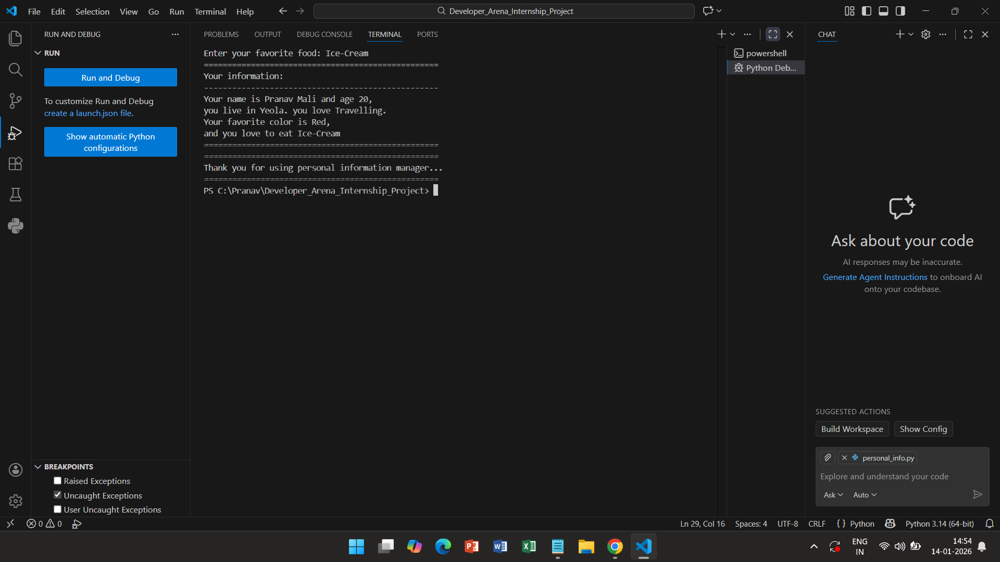

# Personal Information Manager

## Project Overview & Objectives
The Personal Information Manager is a console-based Python application that stores predefined personal details, collects additional user input, and presents all information in a structured and readable format. The project demonstrates effective use of variables, input/output operations, control flow, and string formatting.

---

## Project Description
This program maintains static personal information and dynamically gathers user preferences through terminal input. Basic validation ensures that user input is not empty, and the final output is displayed using clear formatting for improved readability.

---

## What I Learned
- **Variables**: Managing static and dynamic data
- **Input/Output**: Handling user interaction via the terminal
- **String Formatting**: Using f-strings for structured output
- **Validation Logic**: Preventing invalid or empty input using loops

---

## How to Run This Program
1. Ensure Python is installed on your system
2. Open Terminal / Command Prompt
3. Navigate to the project directory
4. Run the program using:
   ```bash
   python personal_info.py
5. Follow the prompts displayed in the terminal

## Features
- Stores static personal information (name, age, city, hobby)
- Collects dynamic user input (favorite color and food)
- Displays all information in a formatted output
- Implements basic input validation
- Calculates age in months

## Code Structure
week1-personal-info/
│── personal_info.py
│── README.md
│── screenshots

## Sample Output
```bash
==================================================
Personal information manager interface
==================================================
Enter your favorite color: Red
Enter your favorite food: Ice-Cream
==================================================
Your information: 
--------------------------------------------------
Your name is Pranav Mali and age 20,
you live in Yeola. you love Travelling.
Your favorite color is Red,
and you love to eat Ice-Cream
==================================================
==================================================
Thank you for using personal information manager...
==================================================
```

## Screenshots
Screenshots of the working application are included to demonstrate program execution.


## Technical Requirements Fulfillment
- Variables: Used to store more than four pieces of personal information
- User Input: Collected multiple user-defined values
- Formatted Output: Implemented using f-strings and separators
- Input Validation: Ensured non-empty user input using control flow

  ## Challenges & Solutions
- Challenge: Handling empty user input
- Solution: Implemented a loop to re-prompt the user until valid input is provided

- Challenge: Producing readable terminal output
- Solution: Applied structured formatting using f-strings and visual separators

## Author

**Pranav Mali**\
The Developers Arena Python Intern
